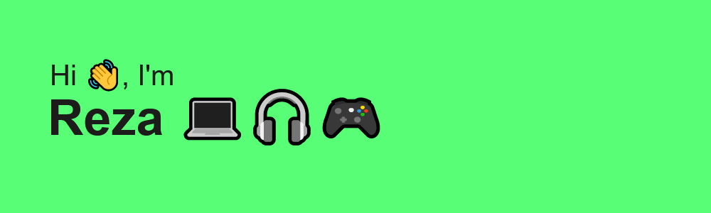

<h1 align="center">Hi 👋, I'm Reza Bakhtiari :computer:</h1>
<h3 align="center">A little Front-end Developer from Iran :house:</h3>

  

  
- 🌱 I’m currently learning **React js**

- 💬 Ask me about **html , css , javascript , react**

- 📫 How to reach me **rezabakhtiari7334@gmail.com**
- 
<h3 align="left">Connect with me:</h3>

## ⚡ Technologies

 
 

&nbsp;

